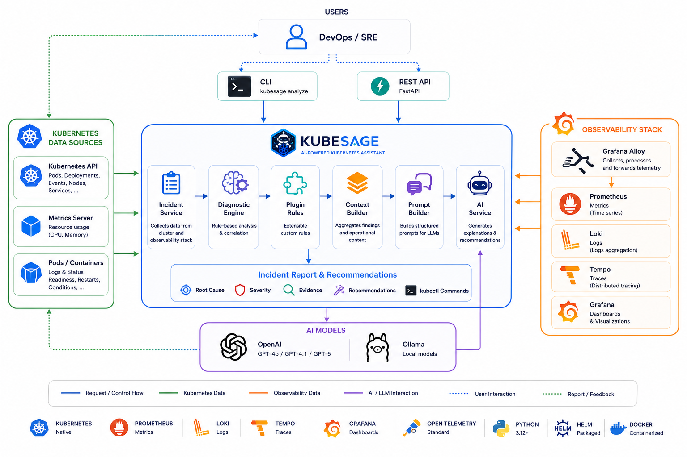

<h1 align="center">🤖 KubeSage</h1>

<p align="center">
  
</p>

<p align="center">
AI-powered Kubernetes Operations Assistant
</p>

<p align="center">
Observe • Explain • Recommend • Act
</p>

<h4 align="center">


</h4>

<h4 align="center">


</h4>

KubeSage is an AI-assisted Kubernetes incident analysis engine designed to help engineers understand, investigate and troubleshoot production incidents faster.

Instead of relying on a single signal such as application logs, KubeSage combines multiple sources of operational data:

Kubernetes resources and events
Application logs
Prometheus metrics
Distributed traces
Rule-based diagnostics
Finding correlation
OpenTelemetry telemetry
Large Language Models (LLMs)

KubeSage transforms these signals into a structured incident analysis containing detected findings, correlations, severity, explanations and actionable recommendations.

The goal is simple:

> **Reduce the time required to understand and troubleshoot Kubernetes incidents.**

# 🚀 Quick Start

```bash
git clone https://github.com/fdebar/KubeSage.git
cd kubesage
make install
uvicorn kubesage.api.app:app --reload
```

Analyze a pod:

```bash
kubesage analyze --namespace default --pod nginx
```

---

# ✨ What is KubeSage?

Kubernetes incidents rarely have a single obvious cause.

A failing application may involve:

* a container running out of memory;
* repeated pod restarts;
* resource contention;
* failing health checks;
* abnormal application logs;
* degraded dependencies;
* unusual resource consumption;
* or several of these conditions at the same time.

Investigating such incidents traditionally requires switching between kubectl, logs, metrics, traces and monitoring dashboards.

KubeSage brings these signals together into a single analysis workflow.

                 Kubernetes
                     │
        ┌────────────┼────────────┐
        │            │            │
       Logs        Events       Resources
        │            │            │
        └────────────┼────────────┘
                     │
               ┌─────▼─────┐
               │  KubeSage │
               │  Analysis │
               └─────┬─────┘
                     │
        ┌────────────┼────────────┐
        │            │            │
    Prometheus      Loki        Tempo
        │            │            │
        └────────────┼────────────┘
                     │
             Diagnostic Engine
                     │
             Findings Correlation
                     │
                AI Analysis
                     │
                     ▼
            Incident Explanation
            + Recommendations

The AI layer is not intended to replace deterministic diagnostics.

KubeSage first collects and analyzes operational evidence using deterministic rules and correlations, then provides this context to an LLM for higher-level explanation and recommendations.

---

# 🏗️ Architecture



KubeSage is composed of several main components:

## Repositories

| Repository | Description |
| --- | --- |
| [KubeSage](https://github.com/fdebar/kubesage) | Backend, analysis engine, API and Helm chart |
| [KubeSage GitOps](https://github.com/fdebar/kubesage-gitops) | Argo CD applications, environment configuration and observability stack |
| [KubeSage Web](https://github.com/fdebar/kubesage-web) | React dashboard |

## **Backend**

A Python/FastAPI service responsible for:

* Kubernetes data collection
* Prometheus queries
* Loki queries
* incident construction
* diagnostic rules
* finding correlation
* AI analysis
* analysis persistence
* API endpoints

## **Frontend**

The KubeSage web dashboard is maintained in a dedicated repository.

The React application provides:

- Incident overview
- Cluster status
- Finding summaries
- Analysis details
- Analysis history
- AI-generated reports

## **Observability**

KubeSage integrates with:

* Prometheus
* Loki
* Tempo
* Grafana
* Grafana Alloy
* OpenTelemetry

This allows both the Kubernetes environment and KubeSage itself to be observed.

## **GitOps**

KubeSage can be deployed using:

* Helm
* Argo CD
* Kubernetes

The deployment configuration is managed declaratively through GitOps.

# 🔍 Analysis Workflow

A typical KubeSage analysis follows this workflow:

```text
┌─────────────────────────┐
│   Kubernetes Incident   │
└────────────┬────────────┘
             │
             ▼
┌─────────────────────────┐
│ Collect Kubernetes Data │
├─────────────────────────┤
│ • Pod information       │
│ • Events                │
│ • Application logs      │
└────────────┬────────────┘
             │
             ▼
┌─────────────────────────────┐
│ Collect Observability Data  │
├─────────────────────────────┤
│ • Prometheus metrics        │
│ • Loki logs                 │
│ • Tempo traces              │
└────────────┬────────────────┘
             │
             ▼
┌─────────────────────────┐
│   Diagnostic Engine     │
├─────────────────────────┤
│ • Rule evaluation       │
│ • Finding generation    │
└────────────┬────────────┘
             │
             ▼
┌─────────────────────────┐
│  Finding Correlation    │
├─────────────────────────┤
│ • Related findings      │
│ • Evidence              │
│ • Confidence            │
└────────────┬────────────┘
             │
             ▼
┌─────────────────────────┐
│      AI Analysis        │
├─────────────────────────┤
│ • Context construction  │
│ • Prompt generation     │
│ • LLM analysis          │
└────────────┬────────────┘
             │
             ▼
┌─────────────────────────┐
│    Incident Report      │
├─────────────────────────┤
│ • Summary               │
│ • Severity              │
│ • Findings              │
│ • Root cause hypotheses │
│ • Recommendations       │
└─────────────────────────┘
```

Each analysis is also instrumented with OpenTelemetry spans, making the internal execution flow visible through distributed tracing.

---

# Features

## Kubernetes Analysis

* 🔍 Kubernetes resource inspection
* 📜 Pod log collection
* 📅 Kubernetes event retrieval
* 📊 Resource usage analysis
* 🔄 Incident context aggregation

## Diagnostic Engine

* 🧠 Rule-based diagnostics
* 🔌 Discoverable diagnostic rules
* 📋 Structured findings
* 🎯 Severity and confidence
* 🔗 Finding correlation
* 🧩 Correlation rules for related operational symptoms

The diagnostic engine is designed to provide deterministic evidence before involving the AI layer.

## Observability

* 📈 Prometheus integration
* 📝 Loki integration
* 🔎 Tempo distributed tracing
* 📡 Grafana Alloy integration
* 🧭 OpenTelemetry instrumentation
* 🔗 Trace correlation
* 📊 KubeSage operational metrics
* 🪵 Structured logging

KubeSage instruments important parts of the analysis pipeline, including Kubernetes collection, observability queries, diagnostic processing, correlation and AI generation.

## AI Analysis

* 🤖 OpenAI-compatible LLM providers
* 🧩 Structured incident context
* 📝 Prompt generation
* 🧠 Context-aware incident explanation
* 🎯 Root-cause hypotheses
* 🛠 Actionable recommendations

The AI operates on structured evidence collected by KubeSage rather than directly querying the Kubernetes cluster.

## Web Dashboard

The KubeSage web dashboard is developed in a separate repository.

The dashboard provides:

* 📊 Cluster overview
* 🚨 Incident analysis
* 🔎 Finding details
* 📚 Analysis history
* 📈 Operational metrics
* 🤖 AI-generated reports

The dashboard complements Grafana rather than replacing it.

Grafana remains focused on observability and infrastructure exploration, while KubeSage focuses on incident investigation and contextual analysis.

## Developer Experience

* 💻 CLI
* 🌐 REST API with FastAPI
* ⚛️ React frontend
* 📦 Helm deployment
* 🔄 GitOps with Argo CD
* 🐳 Docker
* 🧪 Automated tests
* 🔍 Ruff linting
* 🧠 MyPy type checking
* 📐 OpenTelemetry instrumentation
* 🚀 GitHub Actions CI/CD


---

# 🧰 Technology Stack

## Backend

* Python 3.14+
* FastAPI
* Kubernetes Python Client
* Pydantic
* Pytest
* OpenTelemetry

## Frontend

* React
* TypeScript
* Modern React hooks and components
* REST API integration

## Observability

* Prometheus
* Loki
* Tempo
* Grafana
* Grafana Alloy
* OpenTelemetry
* Kubernetes Metrics Server

## AI

* OpenAI-compatible APIs
* OpenAI
* Ollama for local development
* LLM prompt engineering

## Infrastructure

* Kubernetes
* Helm
* Argo CD
* Terraform

## Development

* Docker
* GitHub Actions
* Ruff
* MyPy
* Pytest
* Make

---

# 🔭 Observability Architecture

KubeSage uses an observability stack based on the Grafana ecosystem and OpenTelemetry.

                    Kubernetes
                         │
                         ▼
                   Grafana Alloy
                         │
              ┌──────────┼──────────┐
              │          │          │
              ▼          ▼          ▼
           Prometheus   Loki       Tempo
              │          │          │
              └──────────┼──────────┘
                         │
                         ▼
                     KubeSage
                         │
                         ▼
                    React UI
                         │
                         ▼
                      Grafana

KubeSage itself is also instrumented using OpenTelemetry.

Important operations generate spans such as:

```text
analysis.execute
├── kubernetes.get_pod
├── kubernetes.get_events
├── kubernetes.get_logs
├── prometheus.get_cpu_metrics
├── prometheus.get_memory_metrics
├── rules.crashloop
├── rules.oomkilled
├── findings.correlate
├── prompt.build
├── llm.generate_report
└── database.save_analysis
```

This makes it possible to investigate not only the Kubernetes incident itself, but also the execution of KubeSage's analysis pipeline.

---

# 📊 Metrics

KubeSage exposes Prometheus metrics covering the application and analysis pipeline.

Examples include:

```text
kubesage_http_requests_total
kubesage_analysis_total
kubesage_analysis_duration_seconds
kubesage_kubernetes_duration_seconds
kubesage_kubernetes_errors_total
kubesage_llm_requests_total
kubesage_llm_tokens
kubesage_llm_duration_seconds
kubesage_watcher_incidents_detected_total
````

These metrics provide visibility into:

* API traffic
* analysis throughput
* analysis duration
* Kubernetes API interactions
* Kubernetes collection errors
* LLM requests
* LLM token usage
* LLM latency
* automatically detected incidents

---

# ⚡ Quick Start

## Prerequisites

You will need:

* Python 3.14+
* Kubernetes 1.30+
* kubectl
* Helm 3+
* Docker
* Metrics Server
* Prometheus
* Loki
* Tempo
* Grafana Alloy
* OpenAI-compatible LLM provider (or implement your own provider)

Verify your cluster:

```bash
kubectl cluster-info
kubectl get nodes
kubectl top nodes
```
---

# 💻 Local Development

Clone the repository:

```bash
git clone https://github.com/fdebar/KubeSage.git
cd KubeSage
```

Create a virtual environment:

```bash
python -m venv .venv
source .venv/bin/activate
```

Install the project:

```bash
pip install -e .
```

Run the backend:

```bash
uvicorn kubesage.api.app:app --reload
```

The API is then available locally.

Run the CLI:

```bash
kubesage analyze --namespace default -pod ai-demo-app
```

---

# ⚙️ Configuration

KubeSage can be configured through environment variables.

Example local configuration:

```bash
AI_URL=http://localhost:11434/v1
AI_API_KEY=your_api_key
AI_MODEL=qwen2.5-coder:14b

PROMETHEUS_URL=http://localhost:9090
PROMETHEUS_TIMEOUT=5

LOKI_URL=http://localhost:3100
TEMPO_URL=http://localhost:3200

KUBERNETES_NAMESPACE=default
LOG_LEVEL=INFO
```

The exact configuration depends on the deployment environment and enabled integrations.

---

# 🤖 AI Providers

KubeSage uses an OpenAI-compatible interface so that different LLM backends can be used without changing the analysis pipeline.

## OpenAI

Configure an OpenAI API-compatible endpoint and API key.

```bash
AI_URL=https://api.openai.com/v1
AI_API_KEY=<your_api_key>
AI_MODEL=<your_model>
```

### Ollama

For local development, Ollama can be used.

Example:

```bash
ollama pull llama3
```

Then configure:

```bash
AI_URL=http://localhost:11434/v1
AI_API_KEY=ollama
AI_MODEL=llama3
```

---

# 📦 Helm Deployment

Install KubeSage with Helm:

```bash
helm dependency build charts/kubesage
helm upgrade --install kubesage \
    deploy/kubesage \
    --namespace kubesage \
    --create-namespace \
    -f deploy/kubesage/values.yaml
```

Verify the deployment:

```bash
kubectl get pods -n kubesage
kubectl get svc -n kubesage
```

For GitOps deployments, see the [KubeSage GitOps repository](https://github.com/fdebar/kubesage-gitops).

---

# 🔄 GitOps Deployment

KubeSage uses a dedicated GitOps repository for Kubernetes deployment configuration.

- **[KubeSage](https://github.com/fdebar/kubesage)**
  - Application source code
  - Backend
  - Analysis engine
  - Helm chart

- **[KubeSage GitOps](https://github.com/fdebar/kubesage-gitops)**
  - Argo CD Applications
  - Environment configuration
  - Monitoring stack
  - GitOps deployment configuration

Argo CD continuously reconciles the desired state from the GitOps repository into Kubernetes.

The application Helm chart and environment-specific configuration are intentionally kept in separate repositories.
---

# 🧪 Testing

Run tests:

```bash
pytest
```

On macOS:

```bash
python -m pytest
```

---

# 🧹 Code Quality

Format:

```bash
ruff format .
```

Lint:

```bash
ruff check .
```

Type checking:

```bash
mypy .
```

Additional development commands are available through the Makefile:

```bash
make test
make lint
make format
make check
make fix
make dev-run
make dev-stop
```

---

# 🔎 Example Analysis

A typical incident analysis can combine several operational signals:

```text
Incident: payment-api

Severity: HIGH

Findings:
  • Container restarted repeatedly
  • Memory usage reached container limit
  • Kubernetes reported OOMKilled
  • Memory consumption increased significantly before restart

Correlations:
  • High memory usage
  • OOMKilled
  • Pod restart loop

Root Cause Hypothesis:
  The application exceeded its configured memory limit.

Recommendations:
  • Review the application's memory consumption
  • Check recent deployment changes
  • Review container memory limits
  • Investigate potential memory leaks
```

The final report can then be explored through the KubeSage dashboard together with the underlying findings and analysis context.

# 🖥️ Dashboard

The KubeSage frontend provides a dedicated interface for incident analysis.

The dashboard currently focuses on:

* cluster overview;
* incident summaries;
* finding summaries;
* analysis details;
* historical analyses;
* operational metrics;
* AI-generated reports.

The frontend complements Grafana rather than attempting to replace it.

Grafana remains useful for low-level infrastructure and observability exploration, while KubeSage focuses on incident investigation and contextual analysis.

---

# 🗺️ Roadmap

| Feature | Status |
|----------|--------|
| Kubernetes analysis | ✅ |
| CLI | ✅ |
| REST API | ✅ |
| Diagnostic engine | ✅ |
| Rule-based findings | ✅ |
| Finding correlation | ✅ |
| Prometheus integration | ✅ |
| Loki integration | ✅ |
| Tempo integration | ✅ |
| Grafana Alloy | ✅ |
| OpenTelemetry instrumentation | ✅ |
| Distributed analysis tracing | 🚧 |
| React dashboard | ✅ |
| Analysis history | ✅ |
| Helm deployment | ✅ |
| Docker | ✅ |
| GitHub Actions | ✅ |
| GitOps with Argo CD | ✅ |
| AI incident reports | ✅ |
| Conversational AI | 🚧 |
| Auto-remediation | 🔮 |
| FinOps analysis | 🔮 |

---

# 🧑‍💻 Development Philosophy

KubeSage follows a few core principles:

## Deterministic first

Operational evidence should be collected and evaluated using deterministic mechanisms whenever possible.

## AI as an analysis layer

LLMs should explain and contextualize evidence rather than invent it.

## Observability by design

The analysis engine itself should be observable through metrics, logs and distributed traces.

## Kubernetes-native

KubeSage is designed to run alongside the workloads it analyzes and integrates directly with the Kubernetes ecosystem.

## GitOps-ready

Deployment configuration should be declarative, version-controlled and reproducible.

---

# 🤝 Contributing

Contributions are welcome.

Before submitting major changes:

1. Open an issue
2. Create a feature branch
3. Add tests
4. Submit a Pull Request

---

# 📄 License

MIT License.

---

# 👨‍💻 Author

KubeSage is developed as an engineering project exploring the intersection of:

* Kubernetes
* Cloud infrastructure
* DevOps
* Platform Engineering
* Site Reliability Engineering
* Observability
* Artificial Intelligence
* Large Language Models
